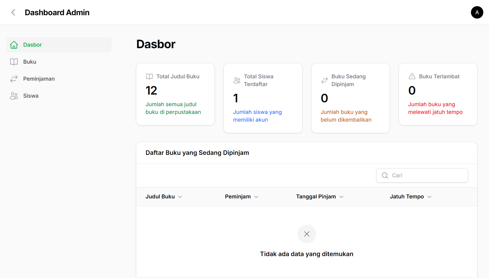
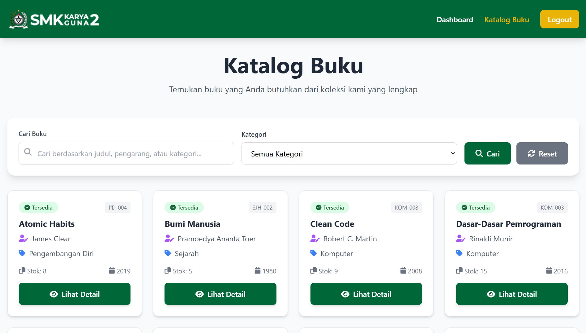
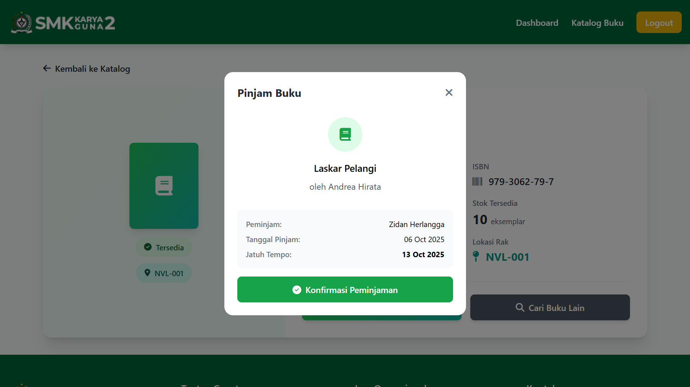
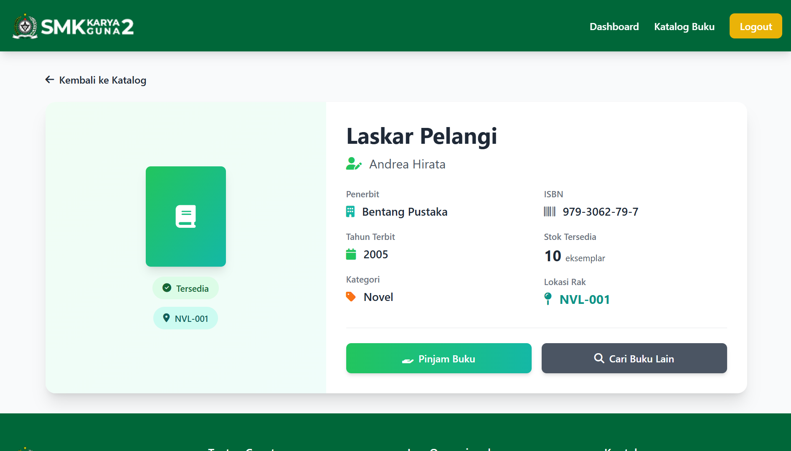
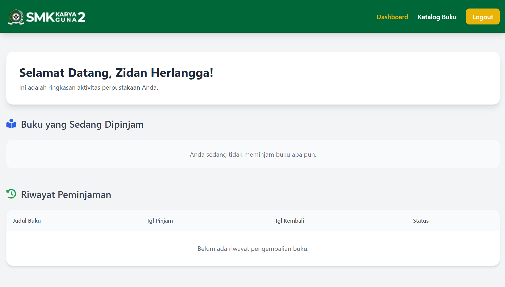

# 📚 Sistem Informasi Perpustakaan Sekolah


<!--  -->


> Aplikasi **Sistem Informasi Perpustakaan Sekolah (SiPerpus)** adalah platform berbasis **Laravel 11 + Filament 4** yang dirancang untuk membantu sekolah dalam mengelola koleksi buku, data siswa, serta transaksi peminjaman dan pengembalian secara efisien dan modern.

---

## 🚀 Fitur Utama

### 🎛️ Panel Admin (Filament 4)
- 📊 **Dashboard Interaktif**: Statistik total buku, siswa, peminjaman, dan keterlambatan dalam satu tampilan.
- 📚 **Manajemen Buku**: CRUD data buku (judul, penulis, penerbit, kategori, stok, ISBN, dll).
- 🧑‍🎓 **Manajemen Siswa**: CRUD data siswa beserta akun login.
- 🔁 **Manajemen Peminjaman**: Form dinamis dengan kalkulasi otomatis tanggal kembali dan denda.
- 🎨 **UI Modern**: Menggunakan komponen **Filament** dan pendekatan modular berbasis Schema (FormSchema, TableSchema).

### 👩‍💻 Halaman Siswa (Frontend)
- 🏠 **Beranda Dinamis**: Statistik real-time dari database.
- 📔 **Katalog Buku**: Daftar koleksi buku lengkap dengan pencarian, filter, dan pagination.
- 🔍 **Detail Buku SEO-Friendly**: URL otomatis seperti `/books/atomic-habits`.
- ✉️ **Registrasi & Verifikasi Email**: Pengguna wajib verifikasi sebelum login.
- 🔐 **Login Aman**: Autentikasi menggunakan email & password.
- 📅 **Dashboard Siswa**: Menampilkan buku yang sedang dipinjam dan riwayat transaksi.
- 🪄 **Pinjam Langsung**: Siswa dapat meminjam buku langsung dari halaman detail buku.
- 🔐 **Lupa Password**: Dapat mengubah password via link gmail

### ⚙️ Fitur Otomatis & Latar Belakang
- 📧 **Notifikasi Otomatis via Email**
  - Pengingat H-1 sebelum tanggal jatuh tempo.
  - Notifikasi keterlambatan + denda otomatis setiap pukul 08.00 WIB.
- 🕒 **Jam Operasional Otomatis**
  - Akses publik ditutup otomatis di hari Sabtu & Minggu menggunakan middleware.
- 🧩 **Arsitektur Modular**
  - Resource, Model, dan Notification terpisah untuk maintainability tinggi.
- 💬 **Chatbot Pintar (OpenAI)**
  - Fitur tambahan untuk eksplorasi buku dan informasi perpustakaan.
  - Riwayat chat disimpan di cache/localStorage dengan validasi sapaan.

---

## 🧰 Teknologi yang Digunakan

| Komponen          | Versi | Deskripsi                   |
|-------------------|-------|-----------------------------|
| **Laravel**       | 11.x  | Framework utama             |
| **Filament**      | 4.x   | Admin panel modern          |
| **PHP**           | 8.2+  | Bahasa backend              |
| **PostgreSQL**    | -     | Database utama              |
| **Composer**      | -     | Dependency manager          |
| **Vite / NPM**    | -     | Asset builder               |
| **SMTP Gmail**    | -     | Pengiriman notifikasi email |
| **OpenAI API**    | -     | Chatbot khusus buku         |

---

## ⚙️ Panduan Instalasi

> Panduan berikut mengasumsikan kamu sudah menginstal **PHP 8.2**, **Composer**, **PostgreSQL**, dan **Node.js (NPM)**.

### 1. Clone Repository

```bash
git clone https://github.com/zidan-herlangga/siperpus.git
cd siperpus
```

### 2. Install Dependensi

```bash
composer install
```

### 3. Install NPM

```bash
npm install
```

### 4. Salin File Environment

```bash
cp .env.example .env
```

### 5. Generate Application Key

```bash
php artisan key:generate
```

### 6. Konfigurasi .env

Pastikan file .env berisi konfigurasi berikut:

```bash
APP_NAME="ELibrary SMK Karya Guna 2"
APP_ENV=local
APP_KEY=
APP_DEBUG=false
APP_TIMEZONE=Asia/Jakarta
APP_URL=http://localhost:8000
APP_LOCALE=id
APP_FALLBACK_LOCALE=en

# OpenAI API Key
OPENAI_API_KEY=sk-proj-xxxxx

DEBUGBAR_ENABLED=false

LOG_CHANNEL=stack
LOG_LEVEL=debug

# PostgreSQL Connection
# Daftar https://supabase.com
DB_CONNECTION=pgsql
DB_HOST=
DB_PORT=5432
DB_DATABASE=postgres
DB_USERNAME=
DB_PASSWORD=

BROADCAST_CONNECTION=log
CACHE_STORE=file
CACHE_DRIVER=file
FILESYSTEM_DISK=local
QUEUE_CONNECTION=sync

SESSION_DRIVER=file
SESSION_LIFETIME=300
SESSION_DOMAIN=null

MEMCACHED_HOST=127.0.0.1

#SMTP Gmail
MAIL_MAILER=smtp
MAIL_HOST=smtp.gmail.com
MAIL_PORT=587

# Auth Google SMTP
MAIL_USERNAME=email@anda.com
MAIL_PASSWORD=xxxxcrqexxxxxxxx # 16 Digit
MAIL_ENCRYPTION=tls
MAIL_FROM_ADDRESS="email@anda.com"
MAIL_FROM_NAME="${APP_NAME}"

VITE_APP_NAME="${APP_NAME}"
# VITE_SERVER_URL=
```

💡 Tips:

-   Gunakan App Password Gmail, bukan password akun utama.
-   Pastikan database siperpus sudah dibuat sebelum migrasi.

### 7. Migrasi & Seed

```bash
php artisan migrate 
php artisan db:seed
```

### 8. Buat Akun Admin

```bash
php artisan make:filament-user
```

### 9. Jalankan Artisan

```bash
php artisan serve
```

### 9. Jalankan NPM

```bash
npm run dev
```

## ScreenShot

| Tampilan                                                     | Deskripsi                                                                                                             |
| ------------------------------------------------------------ | --------------------------------------------------------------------------------------------------------------------- |
|    | **Dashboard Admin (Filament):** Menampilkan statistik total buku, siswa, dan transaksi peminjaman secara _real-time_. |
|            | **Manajemen Buku:** CRUD data buku lengkap dengan filter dan pencarian cepat.                                         |
|  | **Form Peminjaman Buku:** Memilih siswa dan buku secara otomatis, dengan perhitungan tanggal kembali dan denda.       |
|     | **Katalog Buku (Siswa):** Tampilan publik daftar buku dengan desain modern dan SEO-friendly.                          |
|  | **Dashboard Siswa:** Menampilkan buku yang sedang dipinjam dan riwayat peminjaman sebelumnya.                         |
